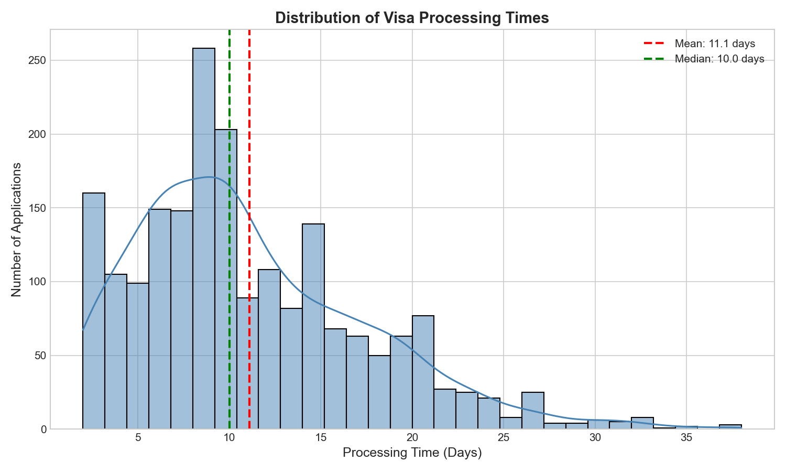

# Milestone 2: EDA & Feature Engineering - Walkthrough

---

## What We Built

| Script | Purpose |
|--------|---------|
| `src/eda_analysis.py` | Creates 8 visualizations |
| `src/feature_engineering.py` | Creates 11 new features |

---

## Script 1: eda_analysis.py

### What It Does
Loads cleaned data → Creates 8 charts → Saves to `reports/figures/`

### Code Summary

```python
# 1. Load data
df = pd.read_csv('visa_applications_cleaned.csv')

# 2. Create charts
sns.histplot(df['processing_time_days'])     # Distribution
ax.bar(visa_counts.index, visa_counts.values) # Visa types
ax.pie(status_counts, autopct='%1.1f%%')      # Status pie
sns.boxplot(x='visa_type', y='processing_time_days')  # Comparison
sns.heatmap(corr_matrix, annot=True)          # Correlations

# 3. Save charts
plt.savefig('reports/figures/chart_name.png')
```

### Output: 8 Charts

| Chart | Key Insight |
|-------|-------------|
|  | Avg = 11 days |
| Visa Type Bar | Tourist 35%, Business 25% |
| Status Pie | 85% Approved |
| Box Plot | Research slowest, Medical fastest |
| Heatmap | Express processing reduces time |
| Monthly Trends | Peak = Oct-Mar |
| Country Analysis | Russia/China take longer |
| Age Distribution | Students youngest |

---

## Script 2: feature_engineering.py

### What It Does
Loads data → Creates new columns → Saves enhanced dataset

### Code Summary

```python
# Feature 1: Seasonal
peak_months = [10, 11, 12, 1, 2, 3]
df['season'] = 'Peak' if month in peak_months else 'Off-Peak'

# Feature 2: Country Average
country_avg = df.groupby('nationality')['processing_time_days'].mean()
df['country_avg_time'] = df['nationality'].map(country_avg)

# Feature 3: Age Groups
bins = [0, 25, 35, 50, 100]
labels = ['Young', 'Adult', 'Middle', 'Senior']
df['age_group'] = pd.cut(df['applicant_age'], bins=bins, labels=labels)

# Feature 4: Risk Score
df['risk_score'] = 0
df['risk_score'] += (docs_incomplete) * 2
df['risk_score'] += (first_time_applicant) * 1
df['risk_score'] += (no_sponsor) * 1
```

### Output: 11 New Features

| Feature | Values | Purpose |
|---------|--------|---------|
| season | Peak/Off-Peak | Tourist season |
| is_peak_season | 0/1 | Binary version |
| country_avg_time | 5-15 days | Country baseline |
| country_deviation | -5 to +5 | vs average |
| visa_type_avg_time | 4-18 days | Visa baseline |
| age_group | Young/Adult/Middle/Senior | Age category |
| age_group_encoded | 0/1/2/3 | Numeric version |
| risk_score | 0-5 | Higher = more risk |
| expected_time | 3-20 days | Standard time |
| efficiency | 0.5-2.0 | Actual ÷ Expected |
| efficiency_category | Fast/Normal/Slow | Speed label |

---

## Final Results

| Metric | Before | After |
|--------|--------|-------|
| Columns | 37 | 48 |
| New Features | - | 11 |
| Charts Created | - | 8 |
| Missing Values | 0 | 0 |

---

## Demo Commands

```bash
# Run EDA
python src/eda_analysis.py

# Run Feature Engineering
python src/feature_engineering.py

# View Charts
start reports\figures

# Check Final Data
python -c "import pandas as pd; df=pd.read_csv('data/processed/visa_applications_featured.csv'); print(f'Columns: {len(df.columns)}')"
```

---

## Explain to Sir (30 seconds)

> "For Milestone 2, I performed EDA by creating 8 visualizations showing processing time patterns, approval rates at 85%, and seasonal trends. I then engineered 11 new features including seasonal index, country averages, age groups, and a risk score that combines factors like document completion and sponsor status. The dataset now has 48 columns ready for machine learning in Milestone 3."

---
